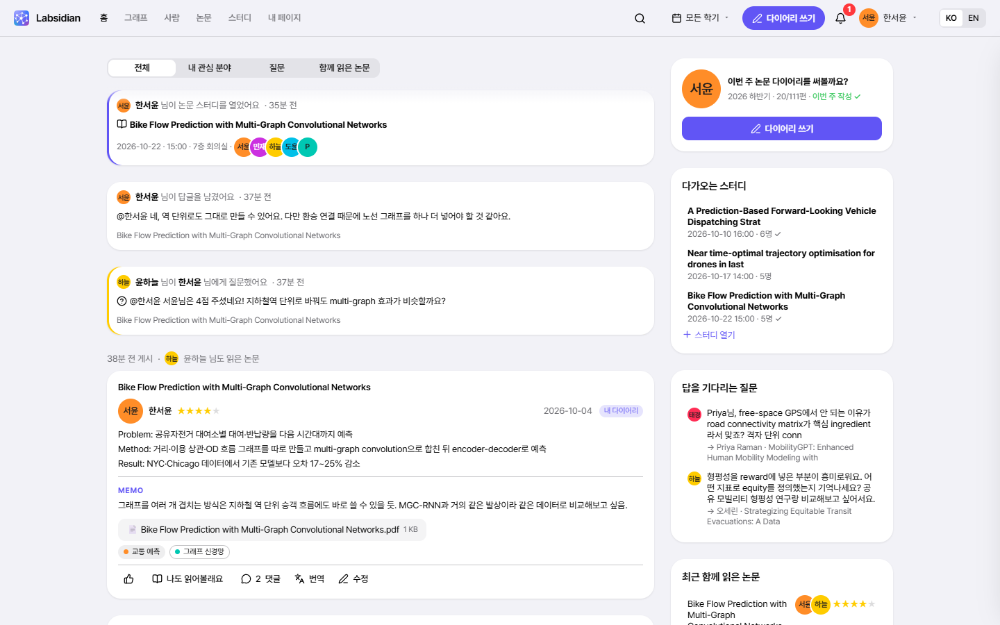
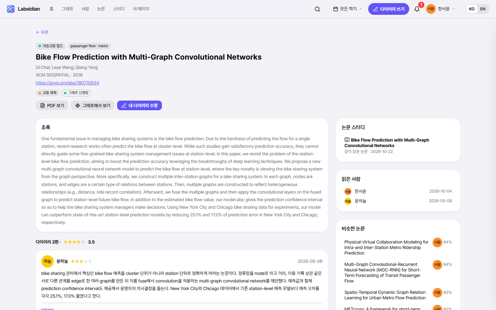
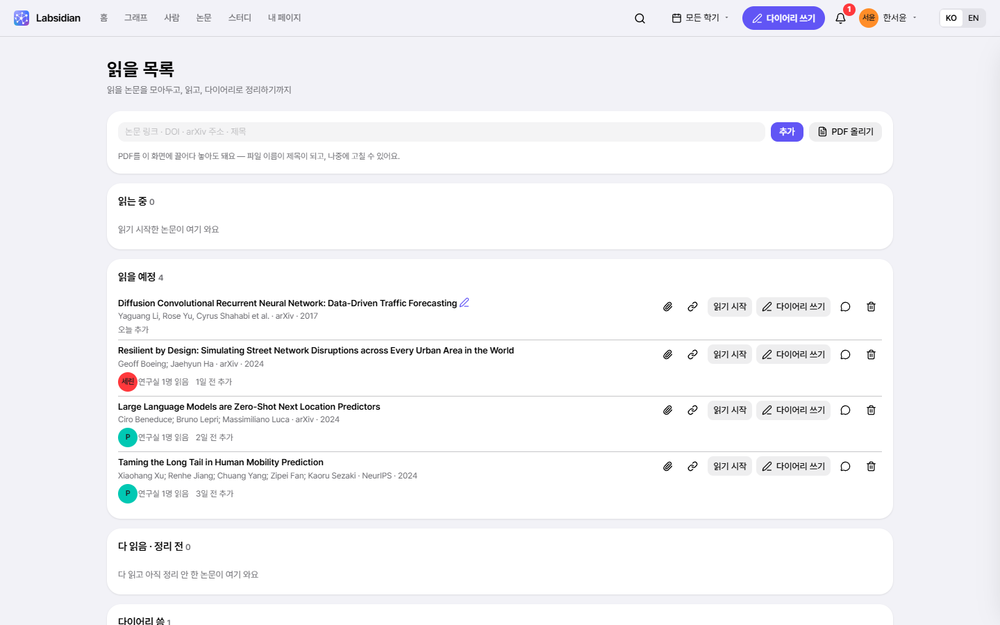
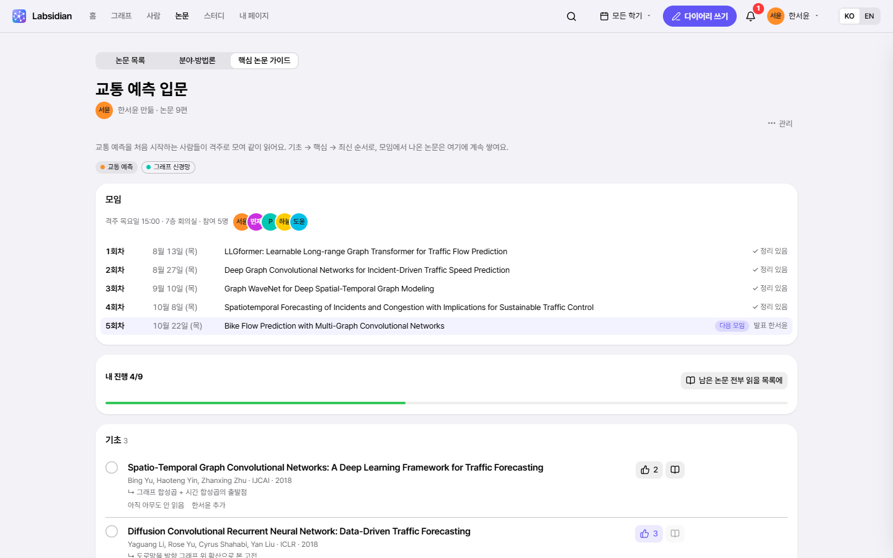
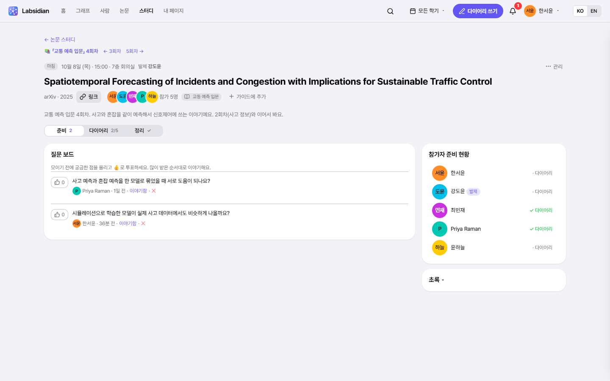
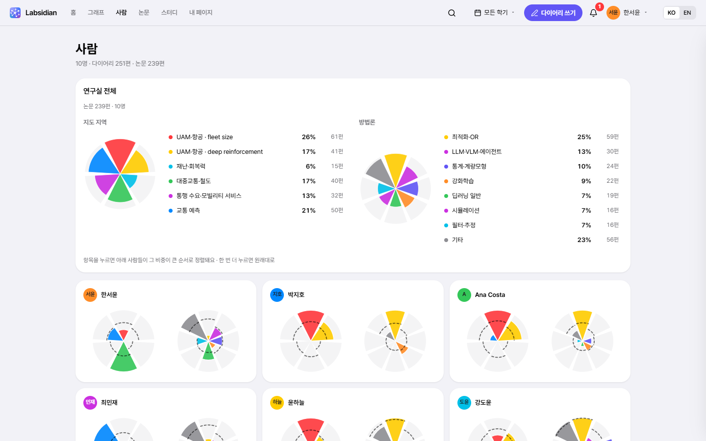

<p align="center"></p>

<h1 align="center">Labsidian</h1>

<p align="center"><b>연구실이 읽은 논문을, 함께 보는 지도로.</b> (Lab + Obsidian)</p>

<p align="center">
  <a href="https://fosemfhtm.github.io/Labsidian/"><b>데모 열기</b></a> ·
  <a href="#4분-영상으로-보기">영상</a> ·
  <a href="#우리-연구실에-도입하기">도입하기</a> ·
  <a href="#내-claude--codex-연결-mcp">내 AI 연결</a> ·
  <a href="CHANGELOG.md">변경 기록</a>
</p>


연구실 멤버가 논문을 읽을 때마다 짧은 다이어리(요약 + 내 생각)를 써요. Labsidian은 그 다이어리를 모아 **비슷한 논문끼리 가까이 놓인 지도** 위에 올리고, 각 논문을 읽은 사람을 이어요. 그 지도에서 다음에 읽을 논문을 찾고, 먼저 읽은 동료의 다이어리를 보고, 질문을 주고받고, 함께 읽을 모임까지 꾸려요.

[데모](https://fosemfhtm.github.io/Labsidian/)는 **가상의 연구실**(멤버 10명 · 다이어리 250편 · 논문 239편)이에요. 로그인 화면에서 아무 멤버나 고르면 바로 들어가지고, 데모에서 바꾼 내용은 내 브라우저에만 저장돼요.

## 왜 만들었나

연구실에서 매주 논문 다이어리를 써도, 쌓인 글은 다시 읽히지 않았어요.

- **누가 무엇을 아는지 몰라요.** 옆자리 동료가 같은 논문을 이미 읽었는데 모르고 처음부터 읽어요.
- **연구실 전체가 보이지 않아요.** 우리가 어느 주제에 몰려 있고 어디가 비어 있는지, 한 학기 동안 관심이 어떻게 옮겨 갔는지 알 길이 없어요.
- **혼자 읽고 끝나요.** 좋은 논문이 질문이나 모임으로 이어지지 않아요.

그래서 다이어리 한 편 한 편을 지도 위의 점으로 만들었어요. 쓰는 사람은 평소처럼 쓰기만 하면 되고, 연구실은 그게 쌓여서 지식이 돼요.

## 4분 영상으로 보기

한 멤버(한서윤)가 지도에서 논문 한 편을 발견해 읽고, 다이어리를 쓰고, 질문을 받고, 연구실 모임의 다음 주제로 올리기까지 따라가요. 영상 속 연구실과 다이어리는 가상 데이터예요.

<!-- 영상을 바꿀 때: 이슈 창에 video/remotion/out/labsidian_demo_readme.mp4 를 끌어다 놓고, 생기는 주소로 아래 줄을 바꿔요 -->
https://github.com/user-attachments/assets/223d4ec7-c6f6-4166-a520-bcb961dbf8c5

| 시각 | 장 | 볼 수 있는 것 |
|---|---|---|
| 0:08 | **지도** | 영역 · 사람 노드(올리면 그 사람의 논문) · 여럿이 읽은 논문(올리면 읽은 사람들) · 사람·논문 누르기 · 두 사람 겹쳐 보기 |
| 0:42 | **찾기** | 필터 · 영역 확대 · 내 논문의 "비슷한 논문"에서 안 읽은 논문 발견 · 로컬 그래프 · 읽을 목록에 담기 |
| 1:08 | **읽기** | 읽을 목록(읽는 중 · PDF · 다 읽음) · 먼저 읽은 동료의 다이어리 · 링크 하나로 논문 추가 |
| 1:30 | **쓰기** | 목록에서 다이어리 쓰기(정보·PDF 자동) · 이미 읽은 사람 알림 · 추천 태그 · 게시하면 지도에 바로 · 내 AI가 만든 초안 |
| 2:06 | **나누기** | 홈 피드 · 알림 · 질문에 @답글 · 함께 읽은 논문 나란히 |
| 2:39 | **함께 읽기** | 핵심 논문 가이드 · 정기 모임(회차) · 블라인드 스터디 · 질문 보드 · 정리 노트 → 다음 모임 |
| 3:33 | **돌아보기** | 내 페이지(작성률 · 공휴일 빠진 달력) · 사람 페이지 · 두 사람 비교 · 한 학기 타임랩스 |

## 연구 흐름 따라 보기

### 지도
- 논문 위치는 제목과 초록으로 정해요([SPECTER2](https://huggingface.co/allenai/specter2) 임베딩 → UMAP). 다이어리 본문은 넣지 않아서 *누가 썼는지*에 따라 위치가 쏠리지 않아요.
- 배경의 **영역**은 내용이 비슷한 논문끼리 자동으로 모인 곳이에요. 멀리서 보면 큰 영역, 다가가면 세부 영역과 논문 제목이 보여요. 영역 이름은 관리자가(또는 관리자의 AI가) 붙여요.
- **사람**은 자기가 읽은 논문들 한가운데에 놓여요. 가까이 있는 사람일수록 관심사가 비슷해요. 사람에 올리면 그 사람의 논문이, 여럿이 읽은 논문(테두리)에 올리면 읽은 사람들이 이어져요.
- 누르면 그 주변만 보여요(로컬 그래프): 논문 → 읽은 사람 → 그 사람들이 읽은 논문. 분야·방법론·학회·연도·별점 필터, 한 학기 타임랩스도 있어요.

### 찾기 · 읽기
- **읽을 목록** — 지도·다이어리에서 담거나, 링크·DOI·arXiv·제목·PDF로 추가해요. 읽을 예정 → 읽는 중 → 다 읽음 → 다이어리 씀까지 이어지고, 오래 묵은 논문은 알려 줘요.
- 논문을 열면 먼저 읽은 동료의 다이어리와 비슷한 논문, 인용 관계가 같이 보여요.

### 쓰기
- 목록에서 바로 쓰면 논문 정보와 PDF가 채워져 있어요. 링크 하나로 서지 정보를 불러오고, 태그는 추천에서 골라요.
- 연구실에서 이미 읽은 논문이면 쓰기 전에 알려 줘요. 게시하는 순간 지도에 올라가요.
- 연구실 양식 그대로 **.docx로 내보내기**.

### 나누기
- 다이어리마다 댓글·질문·아이디어, **@멘션**, 👍, 알림. 홈 피드에 다이어리·질문·답글·새 스터디가 한 흐름으로 와요.
- **함께 읽은 논문** — 같은 논문을 각자 어떻게 읽었는지 나란히.

### 함께 읽기
- **핵심 논문 가이드** — 주제별로 꼭 읽을 논문을 연구실이 함께 모아요(구간, 👍, 내 진행은 다이어리를 쓰면 저절로).
- 가이드를 **정기 모임**으로 돌리면, "다음 모임 만들기"가 날짜·장소·발표 차례·후보 논문(👍 많은 순)을 채워 줘요. 발표자에게는 미리 알림이 가요.
- **논문 스터디** — 모임 전엔 블라인드(먼저 쓰고 나서 남의 것 보기), 질문 보드(투표), 끝나면 정리 노트. 노트의 "다음에 읽을 논문"은 가이드에 다시 쌓여요.

### 돌아보기
- **내 페이지** — 이번 학기 작성률, 작성 달력(주말·공휴일·연구실 휴무는 자동으로 빠짐), 읽을 목록·받은 댓글·다가오는 스터디.
- **사람** — 연구실 전체와 사람마다의 연구 지형(꽃잎 차트), 관심 변화, 관심사가 비슷한 사람, **두 사람 나란히 비교**.

### 그리고
- **내 AI 연결(MCP)** — Claude·Codex에서 "이 PDF 읽고 다이어리 초안 만들어줘" 같은 식으로 [Labsidian을 말로 다뤄요](#내-claude--codex-연결-mcp). AI는 초안까지만, 게시는 본인이 해요.
- 통합 검색(`/` 또는 `Ctrl/⌘ K`) · 한국어 / English · 라이트 / 다크
- **관리자** — 멤버·역할, 학기와 작성 목표, 연구실 휴무일, 태그 병합(되돌리기 가능), 지도 영역 이름.

<table>
<tr>
<td width="33%"><b>홈 피드</b><picture><source media="(prefers-color-scheme: dark)" srcset="docs/screenshots/home-dark.png"></picture></td>
<td width="33%"><b>논문</b><picture><source media="(prefers-color-scheme: dark)" srcset="docs/screenshots/paper-dark.png"></picture></td>
<td width="33%"><b>읽을 목록</b><picture><source media="(prefers-color-scheme: dark)" srcset="docs/screenshots/reading-dark.png"></picture></td>
</tr>
<tr>
<td><b>핵심 논문 가이드 · 정기 모임</b><picture><source media="(prefers-color-scheme: dark)" srcset="docs/screenshots/guide-dark.png"></picture></td>
<td><b>논문 스터디</b><picture><source media="(prefers-color-scheme: dark)" srcset="docs/screenshots/study-dark.png"></picture></td>
<td><b>사람</b><picture><source media="(prefers-color-scheme: dark)" srcset="docs/screenshots/people-dark.png"></picture></td>
</tr>
</table>

## 우리 연구실에 도입하기

### 1. 데모 띄워 보기

Python과 Node.js만 있으면 돼요(사이트는 빌드가 필요 없는 정적 파일, Node는 서버가 요청을 처리할 때 씀).

```bash
git clone https://github.com/fosemfhtm/Labsidian.git
cd Labsidian
python scripts/serve.py            # → http://localhost:8765
```

연구실 데이터(`site/data.js`)가 없으면 가상 연구실이 떠요.

### 2. 우리 다이어리로 지도 만들기

```
Paper Diary .docx ─ parse_diary.py ─▶ diary.json
                                         │ enrich_s2.py   연도·초록·인용수·참고문헌 (Semantic Scholar)
                                         │ build_map.py   SPECTER2 → UMAP → 지도 영역 → 임시 이름(c-TF-IDF)
                                         ▼
                                  build_site.py ─▶ site/data.js ─▶ 사이트 (site/)
```

무거운 계산(임베딩·UMAP)은 미리 해 두고, 사이트는 결과만 읽어요. GPU도 유료 API도 필요 없어요(CPU로 몇 분).

- `parse_diary.py`는 우리 연구실의 Word 양식을 읽어요. 양식이 다르면 이 스크립트를 맞추거나, 같은 `diary.json` 형식(`data/demo/diary.json` 참고)으로 바꿔 넣으면 돼요.
- 분야·방법론 태그는 키워드 규칙(`scripts/taxonomy.py`)으로 붙어요. 지금은 교통·AI 연구실 기준이라, 다른 분야라면 이 파일부터 바꿔요. 잘못 붙은 태그와 영역 이름은 관리자가 사이트나 MCP로 고쳐요.

<details>
<summary>명령 순서</summary>

```bash
# 0) ML 환경 (한 번만) — CPU로 충분
python -m venv .venv
.venv/Scripts/python -m pip install torch --index-url https://download.pytorch.org/whl/cpu
.venv/Scripts/python -m pip install "sentence-transformers<6" adapters umap-learn scikit-learn numpy

# 1) 다이어리 가져오기 (구성원 목록은 data/roster.json — 형식은 data/demo/roster.json 참고)
python scripts/parse_diary.py "2026 상반기 Paper Diary.docx" --term 2026H1

# 2) (선택) 메타데이터 보강 — 키가 없으면 매우 느림. 무료 키: https://www.semanticscholar.org/product/api
S2_API_KEY=... python scripts/enrich_s2.py

# 3) 의미 지도 계산 (~3분) → 사이트 빌드
.venv/Scripts/python scripts/build_map.py          # 논문이 그대로면 --reuse 로 임베딩 재사용
python scripts/build_site.py                        # → site/data.js

# 4) 보기
python scripts/serve.py
```

`scripts/eval_embeddings.py`로 임베딩별 편향(다이어리 언어·쓴 사람이 위치에 얼마나 섞이는지)을 잴 수 있어요. 결과는 [docs/PLAN.md](docs/PLAN.md) 4장에 있어요.

</details>

### 3. 운영

- 로컬 서버에서는 계정·다이어리·댓글·스터디·첨부가 모두 **SQLite 파일 하나**에 저장돼요(실제 `data/labsidian.db`, 데모 `data/demo/labsidian.db`, 둘 다 저장소에 안 올라감). 서버를 켤 때 하루 한 번 `_backup/`에 자동 백업(최근 14개)하고, `sqlite3`나 DB Browser로 바로 열어 볼 수 있어요.
- 다른 탭·멤버·MCP의 변경은 3초마다 가져와요(그래프 지도는 아직 새로고침해야 반영돼요 — [백로그](docs/BACKLOG.md)).
- 로그인은 서버가 확인해요. 로그인하기 전에는 로그인 화면만 보이고 다이어리 데이터는 내려가지 않아요. 비밀번호는 서버에만 해시로 있어요.
- 멤버 계정은 관리자가 만들어요. 관리자 화면에서 임시 비밀번호를 받아 전해 주면, 멤버가 처음 로그인할 때 자기 비밀번호로 바꿔요. 관리자 비밀번호를 잊었거나 첫 관리자라면 서버에서 `python scripts/serve.py --reset-password admin`으로 임시 비밀번호를 받아요.
- 작성 목표는 평일 기준이고, 공휴일은 자동, 연구실 휴무(학회·셧다운)만 관리자가 넣어요.

#### 연구실 서버에 두고 같이 쓰기

연구실 리눅스 서버 한 대에 띄우고, 멤버는 브라우저로 들어와요. 학교 밖에서는 학교 VPN을 켜고 들어오면 돼요.

```bash
python scripts/serve.py 8765 --host 0.0.0.0     # 학교망에서 http://<서버 IP>:8765
```

- 방화벽은 학교망과 VPN 대역만 열어 두세요(KAIST는 `143.248.0.0/16`, KVPN `172.25.0.0/16`).
- 비밀번호가 네트워크로 오가니 서버 앞에 HTTPS(예: Caddy 리버스 프록시)를 두는 걸 권해요. 프록시를 쓰면 serve.py는 `--host` 없이 `127.0.0.1`에 두면 돼요.

## 내 Claude · Codex 연결 (MCP)

각자 자기 AI를 Labsidian에 연결해서 말로 시키는 방식이에요.

```bash
pip install mcp
```

MCP 서버는 내 컴퓨터에서 돌고, 개인 토큰으로 연구실 서버에 로그인해요. 토큰은 관리자가 서버에서 만들어 전해 줘요.

```bash
python scripts/serve.py --token 한서윤      # 서버에서 (관리자) → 토큰이 한 번만 표시돼요
```

**Claude Code**
```bash
claude mcp add labsidian -e LABSIDIAN_URL=http://<서버 주소>:8765 -e LABSIDIAN_TOKEN=<토큰> -- python <저장소 경로>/mcp/labsidian_mcp.py
```

**Codex** (`~/.codex/config.toml`)
```toml
[mcp_servers.labsidian]
command = "python"
args = ["<저장소 경로>/mcp/labsidian_mcp.py"]
env = { LABSIDIAN_URL = "http://<서버 주소>:8765", LABSIDIAN_TOKEN = "<토큰>" }
```

서버는 토큰 주인으로 요청을 처리해요. 관리자 작업용으로는 관리자 계정 토큰으로 한 번 더 등록하면 돼요(예: `claude mcp add labsidian-admin -e LABSIDIAN_TOKEN=<admin 토큰> -- ...`).
서버를 내 컴퓨터에서 직접 띄웠다면 토큰 없이 `LABSIDIAN_USER=<사이트의 멤버 이름>`만 줘도 돼요(데모에서는 `한서윤`, `박지호` 등). 같은 저장소의 `data/.local_secret`이 이 컴퓨터라는 증명이 돼요.
선택: `LABSIDIAN_LAB`(연구실 이름 — AI가 소개할 때 씀), `LABSIDIAN_DOWNLOADS`(`download_pdf`가 PDF를 저장할 폴더, 기본은 임시 폴더).

| 도구 | 하는 일 |
|---|---|
| `search_papers` `get_paper` `get_person` `similar_papers` `recommend_papers` `lab_progress` `list_tags` `whoami` | 읽기 — 논문·다이어리·댓글·관심사·작성률 조회. 검색은 제목에 맞는 논문부터 (번역은 `get_paper`로 받아서 AI가 직접) |
| `my_inbox` | 내 알림 — 답하는 데 필요한 id까지 함께(질문이면 `add_comment(..., reply_to=…)`로 바로 답글), 읽음 처리 |
| `create_draft` `my_drafts` `delete_draft` | 다이어리 **초안** 만들기(PDF 첨부: 로컬 파일이나 읽을 목록 항목) → 내 페이지·알림으로 도착, 본인이 검토 후 게시 (자동 게시 없음) · 초안 목록·지우기 |
| `my_reading_list` `add_to_reading_list` `update_reading_item` `download_pdf` | 읽을 목록 보기, 링크·제목으로 논문 담기, 상태(읽는 중·다 읽음)·메모 바꾸기 · 올려 둔 PDF를 로컬 파일로 꺼내 AI가 읽기 |
| `add_comment` `react_to_diary` | 내 이름으로 댓글·질문·답글(@멘션) · 👍, "나도 읽어볼래요"(→ 읽을 목록) |
| `list_studies` `get_study` | 논문 스터디 목록·상세 (참가자 다이어리 비교, 질문 보드, 정리 노트) |
| `open_study` `join_study` `add_study_question` `vote_study_question` `draft_study_notes` | 스터디 열기(리딩 그룹이면 날짜·장소·발표 차례·후보 논문이 사이트처럼 채워짐) · 참가 · 질문 올리기·👍 · 정리 노트 **초안** |
| `list_guides` `get_guide` `create_guide` `add_guide_item` `vote_guide_item` | 핵심 논문 가이드 보기(누가 읽었는지·내 진행·다룬 스터디·정기 모임 회차), 만들기, 링크·제목으로 논문 추가, 👍 |
| `admin_list_members` `admin_update_member` `admin_set_member_quota` `admin_save_term` `admin_list_off_days` `admin_save_off_day` `admin_remove_off_day` `admin_merge_tags` `admin_rename_tag` `admin_create_tag` | 관리자 전용 — 멤버 목록·역할·비활성화, 작성 의무(시작일·종료일·면제·목표), 학기, 연구실 휴무일, 태그 정리. 계정 생성·비밀번호는 사이트에서만 |
| `admin_list_clusters` `admin_name_cluster` `admin_set_paper_tags` | 관리자 전용 — 지도 영역 이름·키워드 짓기(지도를 다시 만들어도 그 논문들을 따라감), 규칙이 잘못 붙인 분야·방법론 태그 고치기 |

예시:
- "Labsidian에서 차선변경 강화학습 논문 중에 연구실 사람들이 좋게 본 거 찾아줘"
- "읽을 목록에서 읽는 중인 논문 PDF 읽고 다이어리 초안 만들어줘" — PDF도 초안에 붙어서 와요
- "나한테 온 질문 보여주고 답 초안 써줘, 내가 OK하면 달아줘"
- "교통 예측 입문 다음 모임 잡아줘" — 후보(👍 많은 순)와 날짜·발표자를 보여 주고 열어요
- (관리자) "비슷한 태그 찾아서 병합 계획 보여주고, 내가 OK하면 병합해줘"
- (관리자) "지도 영역 이름 중에 내용이랑 안 맞는 거 찾아서 새 이름 제안해줘" — 관리자에게는 매달 1일 사이트 알림으로 정리할 때라고 알려 줘요

> Labsidian 서버(`scripts/serve.py`)가 켜져 있어야 해요(브라우저 탭은 없어도 돼요). 쓰기 요청은 서버가 사이트와 같은 규칙(`site/store.js`)으로 바로 처리해서 성공·거부 이유를 그 자리에서 돌려주고, 모든 요청과 결과는 DB의 `ops` 테이블(`GET /api/ops`)에 남아요. `LABSIDIAN_URL`이 어느 서버인지 정해요(기본은 이 컴퓨터의 8765, 데모는 8766). 공개 데모(GitHub Pages)에서는 동작하지 않아요.
> 자주 하는 일은 MCP 프롬프트로도 있어요 — Claude Code에서 `/`를 치면 나오는 `diary_from_pdf`(PDF로 이번 주 다이어리) · `catch_up`(밀린 알림·질문 정리) · `prepare_study`(스터디 준비: 다이어리 비교·질문 제안) · `next_reading_group_session`(리딩 그룹 다음 모임).
> 동작 확인(데모 서버 `python scripts/serve.py 8766 --demo`): `python mcp/smoke_test.py 한서윤` · 쓰기 도구까지 전부 `--writes`(데모 서버에서만 돌아요)

## 데이터와 프라이버시

- 이 저장소에는 **가상 연구실 데이터만** 있어요(`data/demo/`, `site/data.demo.js`). 실제 연구실 다이어리(구성원 실명·다이어리 전문)는 `.gitignore`로 막혀 있어서 로컬에만 있어요.
- 가상 연구실의 논문은 실제 공개 논문이고, 멤버와 다이어리는 멤버 설정(`data/demo/personas.json`)을 바탕으로 Claude가 썼어요. `scripts/demo_build.py`가 실명이나 실제 다이어리 문장이 섞이지 않았는지 검사해요.
- 공개 데모(GitHub Pages)의 계정과 데이터는 `localStorage`에만 저장돼요. 로그인도 흉내만 내는 것이라 보안 기능이 아니에요.

## 개발

```
site/                     정적 사이트 (빌드 없음)
  store.js                데이터 계층 — 로컬 서버면 SQLite(scripts/serve.py), 정적 호스팅이면 localStorage. MCP 요청도 이 파일의 규칙으로 처리
  app.js · graph.js       라우팅·페이지 · 그래프 (sigma.js + d3-force)
  auth.js · social.js     로그인·헤더·알림 · 댓글·멘션·반응·번역·읽을 목록
  write.js · me.js · admin.js · study.js · home.js · spotlight.js · reading.js
  viz.js · people.js      사람 목록·사람 페이지 시각화(꽃잎 차트) · 두 사람 비교
  diaries.js              한 사람의 다이어리 목록과 관심 변화 차트 (사람 페이지 · 내 페이지가 같이 씀)
  topics.js · guides.js   분야·방법론 탭 · 핵심 논문 가이드
  tokens.css              디자인 토큰 (데스크톱 macOS · 폰 iOS) — 규칙은 docs/design/
  i18n.js                 한/영 문구
  data.demo.js            가상 연구실 데이터 (data.js = 실제 데이터, 저장소에 없음)
scripts/                  다이어리 파싱 → 메타데이터 보강 → 의미 지도 → 사이트 빌드, 로컬 서버(serve.py + store_worker.mjs, SQLite), 디자인 검사
mcp/labsidian_mcp.py      Claude · Codex용 MCP 서버
data/demo/                가상 연구실 원본
video/                    데모 영상 — 콘티(STORYBOARD.md) · record.py(촬영) · remotion/(편집·렌더)
design-kit/               디자인 시스템만 떼어 낸 재사용 폴더
docs/                     기획(PLAN.md · PEOPLE_TOPICS_GUIDES.md) · 디자인 규칙집(design/) · 백로그(BACKLOG.md) · 스크린샷 · GIF
```

- 화면을 바꿀 때는 [디자인 규칙집](docs/design/README.md)을 먼저 보고, 끝나면 `python scripts/design_lint.py`가 통과해야 해요.
- `main`에 push하면 [GitHub Actions](.github/workflows/pages.yml)가 `site/`를 GitHub Pages에 배포해요(`data.demo.js`가 `data.js` 자리에 들어감).
- 고칠 것은 [docs/BACKLOG.md](docs/BACKLOG.md), 버전별 변화는 [CHANGELOG.md](CHANGELOG.md)에 있어요.

<details>
<summary>가상 연구실 다시 만들기</summary>

```bash
python scripts/demo_plan.py        # 멤버별 날짜·논문 배정 → data/demo/_work/ (서브에이전트 입력, 비공개)
# (서브에이전트가 data/demo/parts/<id>.json 작성)
python scripts/demo_build.py       # 합치기 + 누출 검사(실명 · 실제 다이어리 8어절 복사 · 실제 멤버와 관심사 코사인 ≥ 0.7)
LABSIDIAN_DATA=data/demo python scripts/enrich_s2.py
LABSIDIAN_DATA=data/demo .venv/Scripts/python scripts/build_map.py
LABSIDIAN_DATA=data/demo python scripts/build_site.py   # → site/data.demo.js
python scripts/serve.py 8766 --demo
```

</details>

<details>
<summary>데모 영상 다시 만들기</summary>

촬영은 Playwright가 Chrome 화면을 2배 해상도로 캡처하면서 장면·자막·카메라·커서 경로를 `timeline.json`에 남기고, 편집은 Remotion이 macOS 창 · 카메라 줌 · 커서 · 자막을 입혀요. 자막과 카메라는 `timeline.json`에만 있어서 고쳐도 다시 찍을 필요가 없고, 렌더링은 장 단위로 저장해 두어 바뀐 장만 다시 그려요.

```bash
python scripts/serve.py 8766 --demo
.venv/Scripts/python video/record.py      # 다크(기본) · THEME=light 로 라이트 → video/remotion/public/{raw.mp4, timeline.json}
cd video/remotion && npm install
npm run render -- --preview               # → out/preview.mp4 (절반 크기, 빠른 확인)
npm run render                            # → out/labsidian_demo.mp4 (1080p) + out/labsidian_demo_readme.mp4 (10MB 이하 — 이슈 창에 끌어다 놓고 주소를 README에)
npm run gif                               # → docs/labsidian_demo.gif (README 맨 위, 14초)
```

</details>

## 다음 단계

- 연구실 서버에 DB와 로그인을 붙여서 실제 다이어리를 멤버만 볼 수 있게 서비스
- MCP가 로컬 서버 대신 호스팅 DB에 로그인 토큰으로 읽고 쓰기 (지금 서버 API와 같은 명령 형태)

자세한 기획은 [docs/PLAN.md](docs/PLAN.md)에 있어요.
