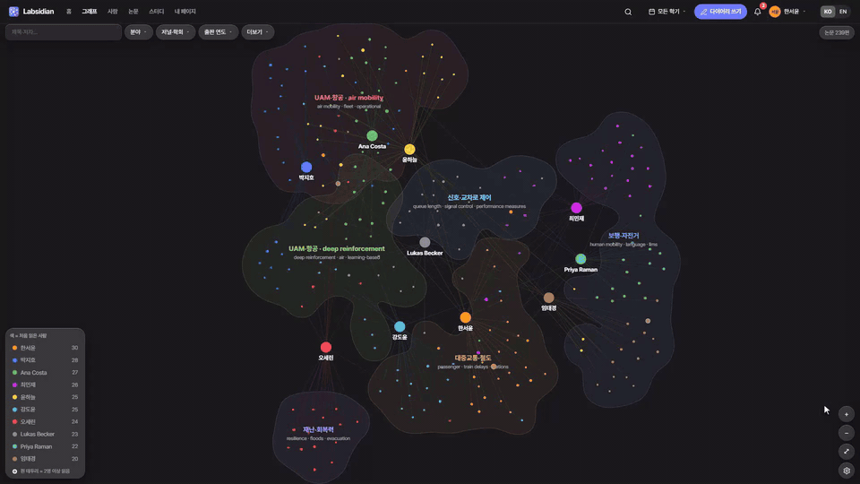
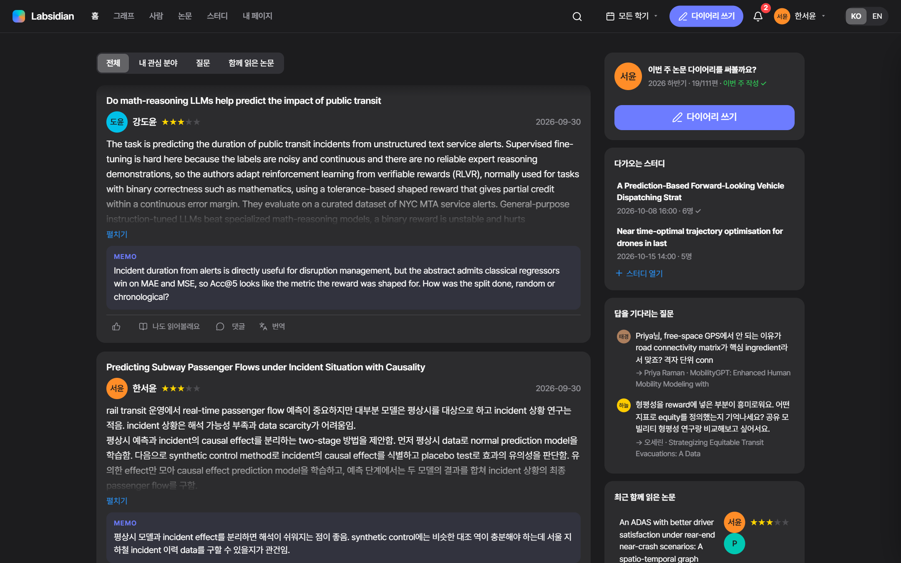
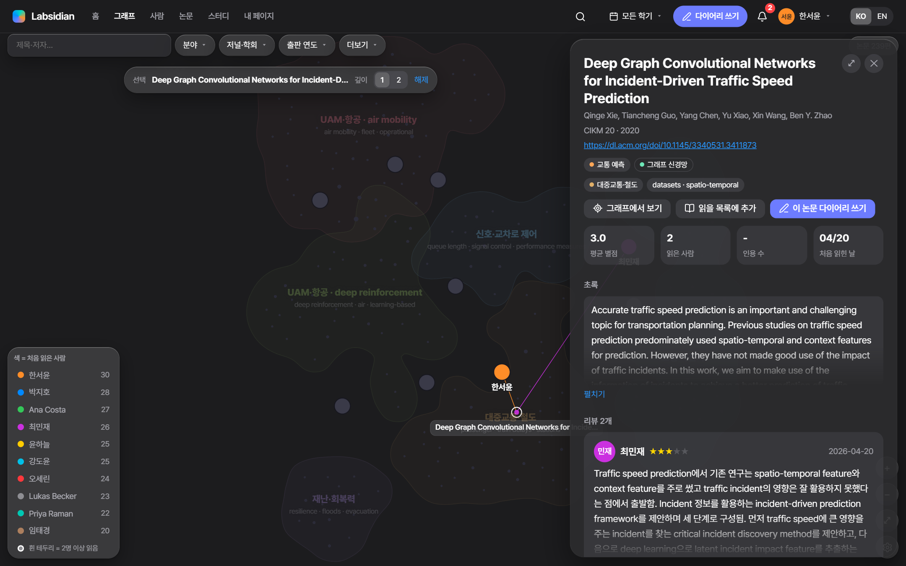
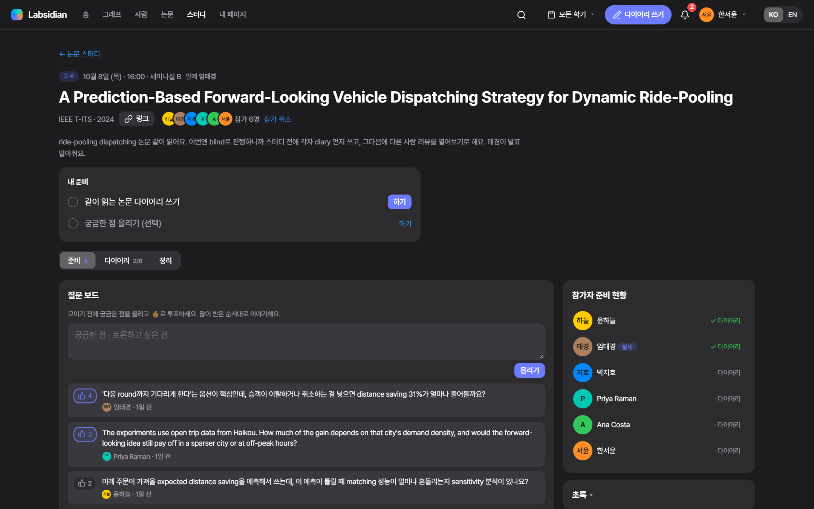

# Labsidian

**연구실 Paper Diary를 지식 그래프로.** (Lab + Obsidian)

연구실 멤버들이 매주 쓰는 논문 리뷰(Paper Diary)를 모아서, *누가 어떤 논문을 읽었고 연구실의 관심사가 어디에 몰려 있는지*를 한 장의 지도로 보여주는 웹사이트예요. 리뷰를 쓰고, 서로의 리뷰에 질문하고, 같이 읽을 논문 스터디를 여는 것까지 한곳에서 해요.

### 👉 [데모 열기 — fosemfhtm.github.io/Labsidian](https://fosemfhtm.github.io/Labsidian/)

로그인 화면에서 아무 멤버나 고르면 바로 들어가져요. 데모는 **가상의 연구실**(멤버 10명 · 리뷰 250편)이고, 데모에서 바꾼 내용은 내 브라우저에만 저장돼요.



**▶ 전체 데모 영상 (2분 24초)** — 한 멤버의 한 주를 따라가면서 모든 기능을 봐요. 영상 속 연구실과 리뷰는 가상 데이터예요.

<!-- 영상을 바꿀 때: 이슈 창에 video/remotion/out/labsidian_demo_720p.mp4 를 끌어다 놓고 생기는 주소로 아래 줄을 교체 -->
https://github.com/user-attachments/assets/72d9b3d5-0d11-4704-ac68-0c455598de82

| 시각 | 장면 |
|---|---|
| 0:05 | **월요일** — 로그인 · 홈 피드(다이어리 · 질문 · 답글 · 스터디) · 알림 · 답글(@멘션) |
| 0:29 | **화요일** — 그래프(주제 군집 · 사람 노드 · 겹치는 관심사 · 필터 · 로컬 그래프) · 반응·읽을 목록 · 사람 페이지(연구실 전체 분야 · 관심사가 비슷한 사람 · 추천) · 검색 |
| 1:15 | **목요일** — 다이어리 쓰기(이미 읽은 사람 알림 · 링크로 서지 정보 · 태그 추천) · 지도에 바로 · 내 페이지(작성률 · docx) |
| 1:37 | **금요일** — 함께 읽은 논문 · 논문 스터디(블라인드 · 질문 보드 · 정리 노트) |
| 1:57 | **그리고** — 내 Claude·Codex 연결(MCP) · AI 초안 → 내가 게시 |
| 2:11 | 타임랩스 · English · 라이트 테마 |

## 주요 기능

- **그래프** — 비슷한 논문끼리 가까이 놓인 의미 지도 위에, 각 논문을 읽은 사람을 연결해요.
  - 논문 위치: 제목+초록의 [SPECTER2](https://huggingface.co/allenai/specter2) 임베딩 → UMAP. 리뷰 본문은 넣지 않아서 *누가 썼는지*에 따라 위치가 쏠리지 않아요.
  - 배경 영역은 주제 군집이에요. 줌아웃하면 큰 주제, 줌인하면 세부 주제와 논문 제목이 보여요.
  - 사람은 자기가 읽은 논문들의 무게중심에 놓여요.
  - 논문을 클릭하면 로컬 그래프(읽은 사람 · 비슷한 논문 · 인용)와 상세 패널이 열려요.
  - 분야·방법론·학회·연도·별점으로 필터하고, 타임랩스로 연구실 관심사가 어떻게 옮겨갔는지 볼 수 있어요.
- **홈 피드** — 최근 리뷰, 내 관심 분야, 답을 기다리는 질문, 함께 읽은 논문, 이번 주 작성 현황
- **다이어리 쓰기** — DOI·arXiv 링크로 논문 정보 자동 채우기, 메모, 별점
- **댓글 · 질문 · @멘션 · 알림**, 읽을 목록, 리뷰 번역(브라우저 내장 번역)
- **논문 스터디** — 같이 읽을 논문을 정하고 각자 다이어리 쓰기 → 질문 보드(투표) → 정리 노트
- **사람 / 논문 / 함께 읽은 논문** 페이지, 비슷한 논문 추천
- **통합 검색** (`/` 또는 `Ctrl/⌘ K`), **한국어 / English**, 라이트 / 다크
- **관리자** — 멤버 관리, 학기·작성 목표 설정, 태그 병합(되돌리기 가능)
- **내 AI 연결 (MCP)** — Claude·Codex에서 "이 PDF 읽고 다이어리 초안 만들어줘" 같은 식으로 [Labsidian을 말로 다뤄요](#내-claude--codex-연결-mcp)

| 홈 | 논문 상세 | 논문 스터디 |
|---|---|---|
|  |  |  |

## 로컬에서 실행

필요한 건 Python과 Node.js예요(사이트는 빌드가 필요 없는 정적 파일, Node는 MCP 요청 처리용).

```bash
git clone https://github.com/fosemfhtm/Labsidian.git
cd Labsidian
python scripts/serve.py            # → http://localhost:8765
```

실제 연구실 데이터(`site/data.js`)가 없으면 자동으로 데모 연구실이 떠요.

로컬 서버에서는 사이트에서 쓰는 모든 것(계정·리뷰·댓글·스터디·첨부)이 SQLite 파일 하나에 저장돼요 — 실제 연구실은 `data/labsidian.db`, 데모는 `data/demo/labsidian.db`(둘 다 저장소에 안 올라감). 서버를 켤 때 하루 한 번 `_backup/`에 자동 백업(최근 14개)하고, `sqlite3`나 DB Browser로 바로 열어볼 수 있어요. 예전처럼 브라우저(localStorage)에만 있던 데이터는 그 브라우저로 사이트를 처음 열 때 서버로 한 번 옮겨져요.

## 어떻게 만들어지나

```
Paper Diary .docx ─ parse_diary.py ─▶ diary.json
                                         │ enrich_s2.py   연도·초록·인용수·참고문헌 (Semantic Scholar)
                                         │ build_map.py   SPECTER2 → UMAP → 군집 → 군집 이름(c-TF-IDF)
                                         ▼
                                  build_site.py ─▶ site/data.js ─▶ 정적 사이트 (site/)
```

무거운 계산(임베딩·UMAP)은 미리 해두고, 사이트는 그 결과만 읽어요. 유료 API는 쓰지 않아요.

<details>
<summary>내 연구실 다이어리로 직접 만들기</summary>

```bash
# 0) ML 환경 (한 번만) — CPU로 충분
python -m venv .venv
.venv/Scripts/python -m pip install torch --index-url https://download.pytorch.org/whl/cpu
.venv/Scripts/python -m pip install "sentence-transformers<6" adapters umap-learn scikit-learn numpy

# 1) 다이어리 가져오기 (구성원 목록은 data/roster.json — 형식은 data/demo/roster.json 참고)
python scripts/parse_diary.py "2026 상반기 Paper Diary.docx" --term 2026H1

# 2) (선택) 메타데이터 보강 — 키가 없으면 매우 느림. 무료 키: https://www.semanticscholar.org/product/api
S2_API_KEY=... python scripts/enrich_s2.py

# 3) 의미 지도 계산 (~3분) → 사이트 빌드
.venv/Scripts/python scripts/build_map.py          # 논문이 그대로면 --reuse 로 임베딩 재사용
python scripts/build_site.py                        # → site/data.js

# 4) 보기
python scripts/serve.py
```

`scripts/eval_embeddings.py`로 임베딩별 편향(리뷰 언어·리뷰어가 위치에 얼마나 섞이는지)을 잴 수 있어요. 결과는 [docs/PLAN.md](docs/PLAN.md) 4장에 있어요.

</details>

## 내 Claude · Codex 연결 (MCP)

각자 자기 AI를 Labsidian에 연결해서 말로 시키는 방식이에요.

```bash
pip install mcp
```

**Claude Code**
```bash
claude mcp add labsidian -e LABSIDIAN_USER=한서윤 -- python <저장소 경로>/mcp/labsidian_mcp.py
```

**Codex** (`~/.codex/config.toml`)
```toml
[mcp_servers.labsidian]
command = "python"
args = ["<저장소 경로>/mcp/labsidian_mcp.py"]
env = { LABSIDIAN_USER = "한서윤" }
```

`LABSIDIAN_USER`는 사이트의 멤버 이름이에요(데모에서는 `한서윤`, `박지호` 등).
관리자 작업용으로는 같은 명령을 이름만 바꿔 한 번 더 등록하면 돼요(예: `claude mcp add labsidian-admin -e LABSIDIAN_USER=admin -- ...`).

| 도구 | 하는 일 |
|---|---|
| `search_papers` `get_paper` `get_person` `similar_papers` `recommend_papers` `lab_progress` `list_tags` `my_inbox` `whoami` | 읽기 — 논문·리뷰·댓글·관심사·작성률 조회 (번역은 `get_paper`로 받아서 AI가 직접) |
| `create_draft` | 다이어리 **초안** 생성 → 내 페이지·알림으로 도착, 본인이 검토 후 게시 (자동 게시 없음) |
| `add_comment` `add_to_reading_list` | 내 이름으로 댓글·질문(@멘션), 읽을 목록 추가 |
| `list_studies` `get_study` | 논문 스터디 목록·상세 (참가자 리뷰 비교, 질문 보드, 정리 노트) |
| `add_study_question` `draft_study_notes` | 스터디 질문 올리기, 정리 노트 **초안** |
| `admin_list_members` `admin_update_member` `admin_set_member_quota` `admin_save_term` `admin_merge_tags` `admin_rename_tag` `admin_create_tag` | 관리자 전용 — 멤버 목록·역할·비활성화, 작성 의무(시작일·종료일·면제·목표), 학기 설정, 태그 정리. 계정 생성·비밀번호는 사이트에서만 |
| `admin_list_clusters` `admin_name_cluster` `admin_set_paper_tags` | 관리자 전용 — 지도 영역 이름·키워드 짓기(지도를 다시 만들어도 그 논문들을 따라감), 규칙이 잘못 붙인 논문 분야·방법 태그 고치기 |

예시:
- "Labsidian에서 차선변경 강화학습 논문 중에 연구실 사람들이 좋게 본 거 찾아줘"
- "이 PDF 읽고 다이어리 초안 만들어줘"
- (관리자) "비슷한 태그 찾아서 병합 계획 보여주고, 내가 OK하면 병합해줘"
- (관리자) "지도 영역 이름 중에 내용이랑 안 맞는 거 찾아서 새 이름 제안해줘" — 관리자에게는 매달 1일 사이트 알림으로 정리할 때라고 알려줘요

> **지금은** 로컬 서버(`scripts/serve.py`)가 켜져 있어야 해요(브라우저 탭은 없어도 돼요). MCP는 서버 API로 읽고, 쓰기 요청은 서버가 사이트와 같은 규칙(`site/store.js`)으로 바로 처리해서 성공·거부 이유를 그 자리에서 돌려줘요. 모든 요청과 결과는 DB의 `ops` 테이블(또는 `GET /api/ops`)에 남아요. `LABSIDIAN_URL`이 어느 서버인지 정해요 — 8765 실제, 8766 데모. 공개 데모(GitHub Pages)에서는 동작하지 않아요.
> 동작 확인(데모 서버 `python scripts/serve.py 8766 --demo`): `python mcp/smoke_test.py 한서윤`

## 데이터와 프라이버시

- 이 저장소에는 **가상 연구실 데이터만** 있어요(`data/demo/`, `site/data.demo.js`). 실제 연구실 다이어리(구성원 실명·리뷰 전문)는 `.gitignore`로 막혀 있어서 로컬에만 있어요.
- 가상 연구실의 논문은 실제 공개 논문이고, 멤버와 리뷰는 멤버 설정(`data/demo/personas.json`)을 바탕으로 Claude가 썼어요. `scripts/demo_build.py`가 실명이나 실제 리뷰 문장이 섞이지 않았는지 검사해요.
- 공개 데모(GitHub Pages)의 계정과 데이터는 `localStorage`에만 저장돼요. 로그인도 흉내만 내는 것이라 보안 기능이 아니에요.

<details>
<summary>가상 연구실 다시 만들기</summary>

```bash
python scripts/demo_plan.py        # 멤버별 날짜·논문 배정 → data/demo/_work/ (서브에이전트 입력, 비공개)
# (서브에이전트가 data/demo/parts/<id>.json 작성)
python scripts/demo_build.py       # 합치기 + 누출 검사(실명 · 실제 리뷰 8어절 복사 · 실제 멤버와 관심사 코사인 ≥ 0.7)
LABSIDIAN_DATA=data/demo python scripts/enrich_s2.py
LABSIDIAN_DATA=data/demo .venv/Scripts/python scripts/build_map.py
LABSIDIAN_DATA=data/demo python scripts/build_site.py   # → site/data.demo.js
python scripts/serve.py 8766 --demo
```

</details>

<details>
<summary>데모 영상 다시 만들기</summary>

촬영은 Playwright(깨끗한 화면 녹화 + 장면·스포트라이트 타임라인), 편집은 Remotion(막 카드 · 자막 · 칩 · 스포트라이트)이 해요. 자막은 `timeline.json`에만 있어서, 문구를 고치면 녹화 없이 렌더만 다시 하면 돼요.

```bash
python scripts/serve.py 8766 --demo
.venv/Scripts/python video/record.py              # Playwright → video/remotion/public/{raw.mp4, timeline.json}
cd video/remotion && npm install
npm run render            # → out/labsidian_demo.mp4 (1080p)
npm run render:readme     # → out/labsidian_demo_720p.mp4 (10MB 이하 — 이슈 창에 끌어다 놓고 주소를 README에)
npm run gif               # → docs/labsidian_demo.gif (README 맨 위, 12초)
```

`scripts/demo_build.py`의 누출 검사가 `video/`의 대본·터미널 장면·오버레이에도 실명이나 실제 리뷰 문장이 없는지 확인해요.

</details>

## 구조

```
site/                     정적 사이트 (빌드 없음)
  store.js                데이터 계층 — 로컬 서버면 SQLite(scripts/serve.py), 정적 호스팅이면 localStorage. MCP 요청도 이 파일의 규칙으로 처리
  app.js · graph.js       라우팅·페이지 · 그래프 (sigma.js + d3-force)
  auth.js · social.js     로그인·헤더·알림 · 댓글·멘션·반응·번역·읽을 목록
  write.js · me.js · admin.js · study.js · home.js · spotlight.js
  i18n.js                 한/영 문구
  data.demo.js            가상 연구실 데이터 (data.js = 실제 데이터, 저장소에 없음)
scripts/                  다이어리 파싱 → 메타데이터 보강 → 의미 지도 → 사이트 빌드, 로컬 서버(serve.py + store_worker.mjs, SQLite)
mcp/labsidian_mcp.py      Claude · Codex용 MCP 서버
data/demo/                가상 연구실 원본
video/                    데모 영상 — record.py(Playwright 촬영) · remotion/(편집·렌더)
docs/                     기획안(PLAN.md) · 디자인(DESIGN.md) · 스크린샷 · 데모 GIF
```

`main`에 push하면 [GitHub Actions](.github/workflows/pages.yml)가 `site/`를 GitHub Pages에 배포해요. 이때 `data.demo.js`가 `data.js` 자리에 들어가요.

## 다음 단계

- 연구실 서버에 DB와 로그인을 붙여서 실제 다이어리를 멤버만 볼 수 있게 서비스
- MCP가 로컬 서버 대신 호스팅 DB에 로그인 토큰으로 읽고 쓰기 (지금 서버 API와 같은 명령 형태)

자세한 기획은 [docs/PLAN.md](docs/PLAN.md)에 있어요.
